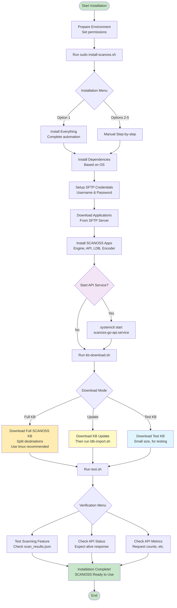

# SCANOSS On-Premise

## Table of Contents

- [TL;DR](#tl;dr)
- [Introduction](#introduction)
- [Hardware Requirements](#hardware-requirements)
  - [Full Knowledge Base Requirements](#full-knowledge-base-requirements)
  - [Test Knowledge Base Requirements](#test-knowledge-base-requirements)
- [Repository Contents](#repository-contents)
- [Installation Guide](#installation-guide)
  - [Preparing the Environment](#preparing-the-environment)
  - [Installing SCANOSS Applications](#installing-scanoss-applications)
  - [Knowledge Base Download (kb-download.sh)](#knowledge-base-download-kb-downloadsh)
    - [KB Download Prerequisites](#kb-download-prerequisites)
    - [Running the Script](#running-the-script)
    - [Command-line Options](#command-line-options)
    - [How it Works](#how-it-works)
    - [Example Sessions](#example-sessions)
    - [Verifying a KB Update](#verifying-a-kb-update)
  - [Verifying Installation](#verifying-installation)
- [Configuration](#configuration)
    - [Manual Installation Workflow](#manual-installation-workflow)
    - [API Service Management](#api-service-management)
    - [API Configuration](#api-configuration)
- [Installation Flow Diagram](#installation-flow-diagram)

- [Support](#support)

---

## TL;DR 

1. Clone this repository: ```git clone https://github.com/scanoss/on-premise.git```
2. Add execution permissions to the installation scripts: ```cd on-premise/install/ && chmod +x *.sh```
3. Run the install-scanoss.sh script: ```sudo ./install-scanoss.sh```
4. Choose option 1) Install everything
5. Run the kb-download.sh script: ```./kb-download.sh``` and choose what to download (full KB, an update, or the test KB)
6. Installation finished!

## Introduction

This document aims to guide users through the process of installing SCANOSS for on-premise environments.

This repository contains all necessary scripts for installing the SCANOSS Knowledge Base (SCANOSS KB), SCANOSS applications (engine, ldb, api and scanoss-encoder), dependencies, knowledge base updates and verifying a correct installation of every component.

To visualize the installation workflow, make sure to see the [Installation Flow Diagram](#installation-flow-diagram) at the end of this guide.

## Hardware Requirements

During installation you will be able to choose between installing the SCANOSS KB or the Test KB (which should only be used for testing, as it's not the complete knowledge base).

### Full Knowledge Base Requirements

The following is recommended for running the SCANOSS Applications and SCANOSS KB:

- Operating systems supported: Debian 11/12 and CentOS

|     | Minimum                   | Recommended               |
|-----|---------------------------|---------------------------|
| **CPU** | 8 Core x64 - 3.5 Ghz      | 32 Core x64 - 3.6 Ghz     |
| **RAM** | 32GB                      | 128GB                     |
| **HDD** | 21.8TB SSD (NVMe preferred) | 24TB SSD (NVMe preferred) |

### Test Knowledge Base Requirements

The following is recommended for running the SCANOSS Applications and SCANOSS Test KB:

- Operating systems supported: Debian 11/12 and CentOS

|     | Minimum                   | Recommended               |
|-----|---------------------------|---------------------------|
| **CPU** | 8 Core x64 - 3.5 Ghz      | 32 Core x64 - 3.6 Ghz     |
| **RAM** | 16GB                      | 32GB                      |
| **HDD** | 700GB SSD (NVMe preferred)| 1TB SSD (NVMe preferred)  | 

## Repository Contents

- [install-scanoss.sh](./install-scanoss.sh): bash script for installing SCANOSS (SFTP user setup creation, dependencies installation and application download/install)
- [kb-download.sh](./kb-download.sh): bash script for downloading the full KB, KB updates, or the test KB from the SCANOSS SFTP server
- [test.sh](./test.sh): bash script for verifying the correct installation of SCANOSS and the SCANOSS KB
- [resources](/resources): directory containing files for testing the installation of SCANOSS and the SCANOSS KB
- [config.sh](./config.sh): configuration file

## Installation Guide

### Preparing The Environment 

You will receive en email from our Sales team containing the credentials to access our SFTP server, take note of those credentials as we are going to use them during the installation.

The first step would be cloning this repository using git:

```
git clone https://github.com/scanoss/on-premise.git
```

Make sure the scripts have execution permissions, if not add them with the following command:

```
cd on-premise/install/
chmod +x *.sh
```

> **_Note:_** The `install-scanoss.sh` script needs to be run as root, either using ```sudo``` or directly as the root user. The `kb-download.sh` script can be run as a regular user.

### Installing SCANOSS Applications

The first script you'll need to run is ``install-scanoss.sh``, this script will take care of setting up your SFTP credentials, installing system/application dependencies and downloading/installing SCANOSS applications.

To run the command type:

```
sudo ./install-scanoss.sh
```

You will be prompted with an option menu, select option 1 ```Install everything``` for an automatic installation of SCANOSS.

After finishing the installation run ```sudo systemctl start scanoss-go-api.service``` to start the API service

> **_Note:_** For more information on installation options, API management and API configuration check [Configuration](#configuration) section at the end of this guide.

### Knowledge Base Download (kb-download.sh)

The `kb-download.sh` script provides a unified way to download the full KB, a KB update, or the test KB directly from the SCANOSS SFTP server. It connects to the server, lists all available versions, lets you choose which one to download, and checks for sufficient disk space before starting. For updates, a separate import script (`ldb-import.sh`) included in the downloaded folder handles importing into your local LDB.

The **test KB** is a small, pre-built LDB used to verify that your installation is working before loading the full production KB.

> **_Note:_** For users wanting to run the download in the background, we recommend using `tmux`:
> 1. Install ```tmux```: ```sudo apt update && sudo apt install tmux``` for Debian or ```sudo yum install epel-release && sudo yum install tmux``` for CentOS.
> 2. Create a session and attach: ```tmux new-session -s mysession```
> 3. Run `./kb-download.sh` inside the session
> 4. Detach with ```Ctrl+B``` then ```d```, reattach with ```tmux attach -t mysession```

#### KB Download Prerequisites

- **lftp** (recommended): provides parallel, resumable downloads (`apt install lftp`). If lftp is not installed, the script will offer to continue with the standard `sftp` client
- **sshpass** (only if using sftp fallback): required to pass the password non-interactively (`apt install sshpass`). Not needed when using lftp.
- **SFTP credentials**: provided by the SCANOSS sales team (host, port, username, password)

#### Running the Script

Make sure the script has execution permissions:

```bash
chmod +x install/kb-download.sh
```

Run the script without arguments for a fully interactive session:

```bash
./kb-download.sh
```

#### Command-line Options

All connection details and the download mode can be passed as arguments to skip the interactive prompts:

```bash
./kb-download.sh -m update -h sftp.test.xyz -P 12345 -u USER21 -p mypassword
```

| Flag | Description |
|------|-------------|
| `-m` | Download mode: `full` (full KB), `update` (KB update), or `test` (test KB) |
| `-h` | SFTP host |
| `-P` | SFTP port |
| `-u` | SFTP username |
| `-p` | SFTP password |
| `-t` | lftp parallel download threads (default: 25) |
| `-d` | Force download tool: `lftp` or `sftp` |
| `-?` | Show help |

Any options not provided on the command line will be prompted interactively.

#### How it Works

1. **Connection**: the script prompts for (or reads from arguments) the SFTP host, port, username, and password
2. **Mode selection**: you choose between downloading the full KB, a KB update, or the test KB
3. **Version discovery** (full/update only): it connects to the SFTP server and lists all available versions of the chosen type, marking which one is the latest. Test KB has no versions — there is only one current test KB on the server.
4. **Selection** (full/update only): you choose which version to download (defaults to the latest)
5. **Disk space check**: the script fetches the metadata and verifies there is enough free disk space before downloading. If not enough is available, you are warned and asked to confirm before continuing.
6. **Download**:
   - **For full KB**: the download is split between two destinations. The `oss` folder (the main LDB data) goes to its own destination (default: `/var/lib/ldb/oss`), and all remaining files and folders go to a separate directory (default: `/tmp/scanoss_kb_full_<version>`). Both destinations can be changed when prompted.
   - **For updates**: the whole update folder is downloaded to a single directory (default: `/tmp/scanoss_kb_update/<version>`).
   - **For test KB**: the test KB's `oss` folder is downloaded to a single destination (default: `/var/lib/ldb/oss`). This will populate your LDB with the test data for verification.
7. **Import (updates only)**: after downloading an update, run the `ldb-import.sh` script included in the downloaded folder

#### Example Sessions

##### Update

```
SCANOSS Knowledge Base Download
================================
Using lftp for downloads (parallel, resumable).

What do you want to download?
  1) Full KB
  2) KB update
  3) Test KB

Select [1-3]: 2

SFTP host: sftp.test.xyz
SFTP port: 12345
SFTP username: USER21
SFTP password:

Fetching available update versions...

Available update versions:
-------------------
  1) 26.01
  2) 26.02
  3) 26.03  (latest)
-------------------

Select a update version to download [1-3] (default: 3):

Selected update: 26.03

Download directory [/tmp/scanoss_kb_update]:

Fetching update metadata...
Update size: 5.2G
Free space:  120G (on /dev/sda1)
Disk space OK.

lftp parallel threads [25]:

Download update 26.03 to /tmp/scanoss_kb_update? [Y/n]
Downloading with lftp (25 parallel threads, resumable)...
Update downloaded to /tmp/scanoss_kb_update/26.03

Finished downloading update.
Please run the ldb-import.sh script provided inside the update folder to import into the KB:
  /tmp/scanoss_kb_update/26.03/ldb-import.sh
```

##### Full KB

```
./kb-download.sh -m full -h sftp.test.xyz -P 12345 -u USER21

SCANOSS Knowledge Base Download
================================
Using lftp for downloads (parallel, resumable).

SFTP password:

Fetching available full KB versions...

Available full KB versions:
-------------------
  1) 26.01
  2) 26.02
  3) 26.03  (latest)
-------------------

Select a full KB version to download [1-3] (default: 3):

Selected full KB: 26.03

Destination for 'oss' folder [/var/lib/ldb/oss]:
Destination for remaining files/folders [/tmp/scanoss_kb_full_26.03]:

Fetching full KB metadata...
Full KB size: 210G
Free space:  500G (on /dev/sda1)
Disk space OK.

lftp parallel threads [25]:

Download full KB 26.03 to /var/lib/ldb/oss + /tmp/scanoss_kb_full_26.03? [Y/n]
Downloading kb/full/26.03/oss with lftp (25 parallel threads, resumable)...
Downloading kb/full/26.03/md5sum with lftp (25 parallel threads, resumable)...
Downloading kb/full/26.03/26.03_files.md5sum with lftp (25 parallel threads, resumable)...

Full KB downloaded:
  oss folder:  /var/lib/ldb/oss
  other files: /tmp/scanoss_kb_full_26.03

Finished downloading full KB.
```

##### Test KB

```
./kb-download.sh -m test -h sftp.test.xyz -P 12345 -u USER21

SCANOSS Knowledge Base Download
================================
Using lftp for downloads (parallel, resumable).

SFTP password:

Destination for test KB [/var/lib/ldb/oss]:

Fetching test KB metadata...
Test KB size: 180M
Free space:   500G (on /dev/sda1)
Disk space OK.

lftp parallel threads [25]:

Download test KB to /var/lib/ldb/oss? [Y/n]
Downloading kb/test/oss with lftp (25 parallel threads, resumable)...
Test KB downloaded to /var/lib/ldb/oss

Finished downloading test KB.
```

#### Verifying a KB Update

After importing an update, verify the installation by scanning the test WFP files included in the update directory:

```bash
scanoss-py scan /tmp/scanoss_kb_update/26.03/26.03_test_file.wfp
scanoss-py scan /tmp/scanoss_kb_update/26.03/26.03_test_snippet.wfp
```

If both scans return appropriate matches, the update was imported successfully.

> **Note:** If the import is interrupted, it may cause corruption in the existing LDB.

### Verifying installation

After running ```install-scanoss.sh``` and ```kb-download.sh```, you will have installed everything you need to run SCANOSS.

The only thing left to do is verifying everything is functioning properly, and for that we will be using the ```test.sh```  script.

Before running this script, make sure the ```/resources``` folder has read permissions, if not add them with:

```
chmod -R +r /resources
```

To run the command type:

```
./test.sh
```

After executing the script, you will be prompted with the following menu

```
Starting verification script for SCANOSS...

Select options from the menu to verify different aspects of your environment
----------------------------------------------------------------------------
1) Verify scanning feature
2) Check API service status
3) Check API service metrics
4) Quit
```

The output to look for would be the following:

- For the ```Verify scanning feature``` option, you will get a file called ```scan_results.json```. Make sure the file is showing a file match for the test file located on the ```/resources``` folder.
- For the ```Check API service status``` you should get ```{"alive"}: true``` as a response.
- And, for the ```Check API service metrics``` you should get the number of requests, performed scans and so on.

After verifying every part of SCANOSS is working, the installation process would be finished

## Configuration

### Manual Installation Workflow

In some cases, users may prefer to manually trigger each step and maybe skipping one (e.g. users who may want to download packages from one computer, and installing them in another). So if you are in this situation, the correct workflow for manual trigger of options would be:

1. Install Dependencies: this will automatically download all required system dependencies, based on your OS
2. Setup SFTP Credentials: this option will prompt the user for their credentials (SFTP user and password)
3. Download Application: this option will let you choose between download application packages from our SFTP server, or downloading it manually (instructions for setting up the correct directory structure and permissions included on the script)
4. Install Application: this option will prompt the user with another menu with different options such as ```Install all applications and application dependencies```, ```Install application dependencies``` and options for installing each SCANOSS application separately.

> **_Note:_**  During the script, you will also be prompted for setting up installation paths and so on. We recommend using the default values for most options, this will make it easier for debugging if needed.

### API Service Management

By default, the script doesn't start the API service, in order to start it run the following command:

```
systemctl start scanoss-go-api.service
```

To check the status of the service run

```
systemctl status scanoss-go-api.service
```

And to stop the service run:

```
systemctl stop scanoss-go-api.service
```

### API Configuration

In case you want to modify the configuration of the API service, the configuration file will be located in ```/opt/scanoss/tmp/scripts/app-config-prod.json``` (defined by the APP_DIR variable in ```config.sh```).

Inside the configuration file, you will see multiple options such as app information, logging, telemetry, networking, TLS encryption and filtering. All the available configuration options are already present in the file, though some may be empty.

To restart the service with the new options you added/modified, run the ```install-scanoss.sh``` choose option 5) Install Application and then option 5) API, and the service will update with the new configuration.

## Installation Flow Diagram

<div style="width: 100%; max-width: 500px;">




## Support

If you encounter any issues with the scripts or have any questions, feel free to get in touch with us through the channels provided by the sales team.
